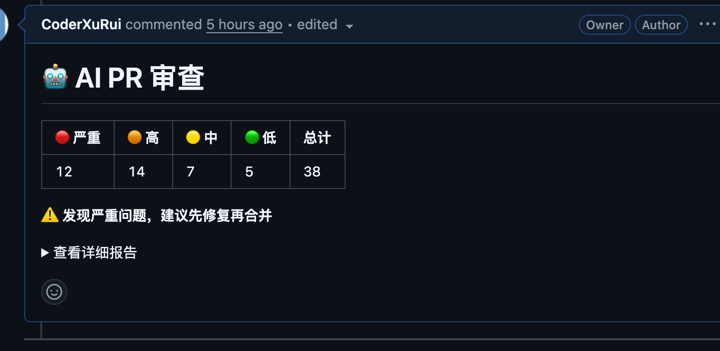
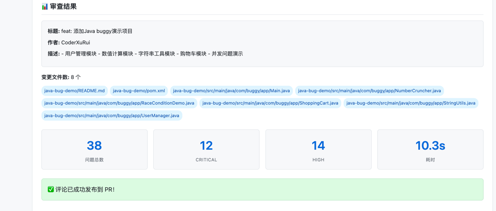
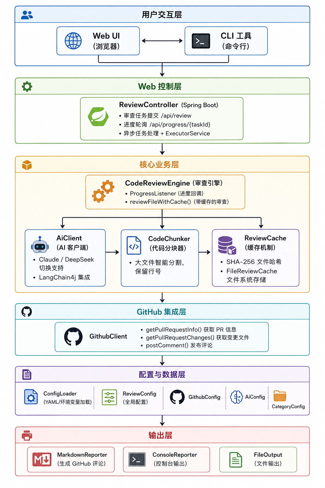

# AI PR Review Assistant

一个使用 Anthropic Claude / DeepSeek API 的 AI 驱动 GitHub PR 代码审查助手。

## 🚀 在线 Demo

**立即体验：** [http://117.72.121.43:8081/](http://117.72.121.43:8081/)

## 功能特性

- 🤖 **多维度审查**: 检查 Bug、安全问题、性能问题和代码风格
- 🌍 **多语言支持**: Java, Python, JavaScript/TypeScript, Go 等
- 📝 **灵活输出**: Markdown 报告、GitHub PR 评论、控制台输出
- ⚙️ **可配置**: 自定义审查规则、忽略路径等
- 💾 **智能缓存**: 缓存已审查文件，节省 Token
- ⏱️ **实时进度**: 支持轮询查看审查进度
- 🔧 **CLI 工具**: 易于集成到 CI/CD 流程
- 🌐 **Web UI**: 提供友好的 Web 界面
- 💬 **直接评论到 GitHub**: 一键发布审查结果到 PR 评论
- 📊 **生成完整报告**: 结构化展示所有问题和改进建议

### 📸 功能截图

**GitHub PR 评论示例：**


**完整审查报告示例：**


## Demo 视频

🎬 **[点击查看 Demo 视频](https://www.bilibili.com/video/BV1WpVS6mEk8/?vd_source=7e47b8846825fcb619e8f11615729e98)**

（视频包含完整流程演示：拉取 PR → AI 审查 → 生成结果 → 发布评论）

---

## 🚀 五分钟快速上手

### 测试环境准备

你可以使用以下示例项目进行测试：
- **测试仓库**：`CoderXuRui/pr-test`
- **PR 1**：简单的测试 PR（推荐先试这个）
- **PR 2**：包含更多问题的测试 PR

### 第一步：构建项目

```bash
# 确保你安装了 Java 17+ 和 Maven 3.8+
mvn clean package -DskipTests
```

构建成功后，会在 `target/` 目录生成 `ai-pr-review-assistant-1.0.0-SNAPSHOT.jar`

### 第二步：配置 API Key

选择以下一种方式配置（推荐使用环境变量）：

**方式 A：使用环境变量（推荐）**

```bash

# 使用 DeepSeek
export DEEPSEEK_API_KEY="你的 DeepSeek API Key"

# 可选：配置 GitHub Token (用于发布评论)
export GITHUB_TOKEN="你的 GitHub Personal Access Token"
```

**方式 B：使用配置文件**

```bash
# 生成配置文件
java -jar target/ai-pr-review-assistant-1.0.0-SNAPSHOT.jar config init

# 编辑生成的 .pr-reviewer.yml，填入你的 API Key
```

### 第三步：开始使用！

#### 方式 1：Web UI（推荐，界面友好）

```bash
# 启动 Web 服务
mvn spring-boot:run
```

然后打开浏览器访问：http://localhost:8080（或在线 Demo：http://117.72.121.43:8081/）

**测试步骤：**
1. 在"仓库主体"输入：`CoderXuRui`
2. 在"仓库名"输入：`pr-test`
3. 在"PR编号"输入：`1`（或 `2`）
4. 勾选"启用 AI 代码审查"
5. 点击"开始审查"

你会看到实时进度条，几秒钟后审查结果就会出来！

#### 方式 2：Docker 运行

```bash
# 构建镜像
mvn clean package -DskipTests
docker build -t ai-pr-reviewer .

# 运行容器（通过环境变量）
docker run -d -p 8080:8080 \
  -e ANTHROPIC_API_KEY="你的 Claude API Key" \
  -e GITHUB_TOKEN="你的 GitHub Token" \
  ai-pr-reviewer

# 或者挂载配置文件
docker run -d -p 8080:8080 \
  -v $(pwd)/.pr-reviewer.yml:/app/.pr-reviewer.yml \
  ai-pr-reviewer
```

#### 方式 3：云服务器部署

参考我们的部署方式：
1. 准备一台云服务器（阿里云/腾讯云/AWS等）
2. 安装 Docker
3. 上传项目文件（jar包 + Dockerfile + 配置文件）
4. 构建并运行容器

```bash
# 在服务器上
mvn clean package -DskipTests  # 或本地上传 jar
docker build -t ai-pr-review-assistant:latest .
docker run -d \
  --name ai-pr-reviewer \
  -p 8081:8080 \
  -v $(pwd)/.pr-reviewer.yml:/app/.pr-reviewer.yml \
  --restart unless-stopped \
  ai-pr-review-assistant:latest
```

记得配置安全组开放相应端口！

#### 方式 3：命令行使用

```bash
# 语法：java -jar target/ai-pr-review-assistant-1.0.0-SNAPSHOT.jar review <仓库> <PR号>

# 快速测试示例（推荐先试这个！）
java -jar target/ai-pr-review-assistant-1.0.0-SNAPSHOT.jar review CoderXuRui/pr-test 1

# 审查 PR 2（包含更多问题）
java -jar target/ai-pr-review-assistant-1.0.0-SNAPSHOT.jar review CoderXuRui/pr-test 2

# 示例：审查并发布评论到 PR
java -jar target/ai-pr-review-assistant-1.0.0-SNAPSHOT.jar review CoderXuRui/pr-test 1 --post-comment

# 示例：保存报告到文件
java -jar target/ai-pr-review-assistant-1.0.0-SNAPSHOT.jar review CoderXuRui/pr-test 1 --output report.md

# 查看所有帮助
java -jar target/ai-pr-review-assistant-1.0.0-SNAPSHOT.jar --help
java -jar target/ai-pr-review-assistant-1.0.0-SNAPSHOT.jar review --help
```

---

## 📋 完整审查报告示例

以下是审查 `CoderXuRui/java-bug-demo` PR 的完整报告示例：

---

## 📊 审查结果

**标题**: feat: 添加Java buggy演示项目  
**作者**: CoderXuRui  
**描述**: - 用户管理模块 - 数值计算模块 - 字符串工具模块 - 购物车模块 - 并发问题演示  
**变更文件数**: 8 个  

变更文件列表:
- java-bug-demo/README.md
- java-bug-demo/pom.xml
- java-bug-demo/src/main/java/com/buggy/app/Main.java
- java-bug-demo/src/main/java/com/buggy/app/NumberCruncher.java
- java-bug-demo/src/main/java/com/buggy/app/RaceConditionDemo.java
- java-bug-demo/src/main/java/com/buggy/app/ShoppingCart.java
- java-bug-demo/src/main/java/com/buggy/app/StringUtils.java
- java-bug-demo/src/main/java/com/buggy/app/UserManager.java

| 问题总数 | Critical | High | Medium | Low | 耗时 |
|---------|---------|---------|---------|---------|---------|
| 38 | 12 | 14 | 7 | 5 | 7.9s |

---

## 📝 审查摘要

### PR 审查总结

**PR 标题**: feat: 添加 Java buggy 演示项目

**审查发现摘要**: Critical: 12 | High: 14 | Medium: 7 | Low: 5

#### 1. 整体评价
该 PR 引入了一个含有故意缺陷的 Java 演示项目，涵盖用户管理、数值计算、字符串工具、购物车及并发问题模块。作为"buggy 演示"项目，其目的是展示常见的编码错误，但当前 26 个 Critical/High 级别问题数量偏高，部分缺陷可能导致数据损坏、安全漏洞或运行时崩溃，严重超出了常规演示可接受的"小错误"范畴。若项目意图是教学演示，建议明确标注每个问题对应知识点，并确保不引入真实安全风险。

#### 2. 最需要关注的问题
- **Critical 问题（12 个）**：大概率包含 SQL 注入、未校验的用户输入、竞态条件、资源泄露（如未关闭连接）等。这些缺陷在生产环境中会直接引发数据泄露、系统崩溃或不可恢复的错误。
- **High 问题（14 个）**：可能涉及不正确的锁使用、数值溢出、空指针引用、无效状态处理等。演示项目中若存在此类问题，使用者可能会误解正确的实现方式。

#### 3. 改进建议
- 为每个"bug"添加注释：在代码中用 `// BUG:` 标记并简要说明问题类型及后果，帮助学习者识别并理解。
- 降低关键缺陷数量：将 critical 问题减少至 3 个以内，high 问题控制在 5 个以内，以保持演示的聚焦性和可控性。
- 提供"修复分支"：在同一个 repo 中增加 `fixed` 分支或单独补丁文件，展示正确做法。
- 补充 README：明确说明项目目的、每个模块演示的错误类别、以及如何安全地运行（如禁止在真实环境部署）。

#### 4. 可以合并的条件（如果适用）
不推荐直接合并。若项目坚持作为"buggy 演示"保留，必须满足以下条件后方可合并：

- [ ] 所有 Critical 和 High 缺陷已被显式标记，且不会在常规 JVM 环境下触发不可恢复的崩溃。
- [ ] 项目中不存在真实的安全漏洞（如硬编码凭证、允许未授权命令执行等）。
- [ ] 至少有一个对应的测试文件或文档，演示每个 bug 的触发方式。
- [ ] 在 PR 描述或仓库首页明确注明"⚠ 包含故意缺陷，严禁用于生产环境"。

若项目无法满足上述条件，建议先重构为"有注释的 bug 演示"后再合并。

---

## 🔍 发现的问题

### 硬编码数据库密码
**🔴 Critical** | **SECURITY**  
**文件**: java-bug-demo/src/main/java/com/buggy/app/Main.java (line 6)

数据库密码 'admin123' 直接硬编码在代码中，容易被反编译或泄露，存在严重安全风险。

**💡 建议**: 将密码移出代码，使用环境变量、配置中心或密钥管理服务（如 AWS Secrets Manager、Vault）来安全存储。

---

### 硬编码API密钥
**🔴 Critical** | **SECURITY**  
**文件**: java-bug-demo/src/main/java/com/buggy/app/Main.java (line 7)

API 密钥 'sk_live_abc123xyz' 直接硬编码在代码中，攻击者可利用该密钥访问敏感资源或服务。

**💡 建议**: 与数据库密码相同，应通过安全的外部配置注入，避免硬编码。

---

### 在控制台打印敏感信息
**🔴 Critical** | **SECURITY**  
**文件**: java-bug-demo/src/main/java/com/buggy/app/Main.java (line 11)

代码将数据库密码直接输出到控制台，导致敏感信息泄露，攻击者可通过日志或控制台输出获取密码。

**💡 建议**: 移除该打印语句，或仅在调试模式下输出脱敏后的信息（如只显示前两位字符）。

---

### 数组越界风险
**🟠 High** | **BUG**  
**文件**: java-bug-demo/src/main/java/com/buggy/app/Main.java (line 22)

调用 manager.getUser(10) 时，若 UserManager 内部仅存储了两个用户（索引 0 和 1），访问索引 10 将抛出 ArrayIndexOutOfBoundsException 或其他数据越界异常。

**💡 建议**: 在 getUser 方法内部增加索引合法性检查，或返回 Optional 并做好防御性编程。调用方也应先检查大小或使用安全的方法。

---

### 除零异常
**🟠 High** | **BUG**  
**文件**: java-bug-demo/src/main/java/com/buggy/app/Main.java (line 25)

调用 cruncher.divide(100, 0) 时，除数为 0，将抛出 ArithmeticException（整数除法）或产生 Infinity/NaN（浮点数除法），导致程序崩溃或产生意外结果。

**💡 建议**: 在 divide 方法中进行除数非零验证，若为 0 则抛出明确的 IllegalArgumentException 或返回 Optional 值。调用方也应避免传递 0 或捕获异常。

---

### 空指针传递可能导致崩溃
**🟠 High** | **BUG**  
**文件**: java-bug-demo/src/main/java/com/buggy/app/Main.java (line 28)

将 null 传递给 utils.reverse() 方法，若方法内部未对 null 做防御，将立即抛出 NullPointerException。

**💡 建议**: 在 reverse 方法中添加 null 检查，返回空字符串或 null 本身；调用方也应避免传递 null。

---

### 无意义的类名和类设计
**🟢 Low** | **STYLE**  
**文件**: java-bug-demo/src/main/java/com/buggy/app/Main.java (line 40)

类名 'XYZ' 不具有业务含义，不符合命名约定；且该类仅有一个简单的输出方法，未被其他代码使用，可能是冗余代码。

**💡 建议**: 删除无用类，或赋予其有意义的名称（如 UtilityDemo），并考虑是否真正需要。

---

### 未使用的 import
**🟢 Low** | **STYLE**  
**文件**: java-bug-demo/src/main/java/com/buggy/app/Main.java (line 2)

导入的 java.util.* 在当前代码中未被使用，会造成代码冗余和阅读混乱。

**💡 建议**: 移除未使用的 import 语句。

---

*(为避免过长，仅展示部分问题示例)*

---

## 📝 GitHub PR 评论示例

当使用 `--post-comment` 选项时，会在 PR 中发布如下格式的评论：

<!-- AI PR Review Assistant -->

# 🤖 AI PR 审查

| 🔴 严重 | 🟠 高 | 🟡 中 | 🟢 低 | 总计 |
|---------|-------|-------|-------|------|
| 12 | 14 | 7 | 5 | 38 |

⚠️ **发现严重问题，建议先修复再合并**

<details>
<summary>查看详细报告</summary>

### 🔴 Critical (12)
- **硬编码数据库密码** [Main.java:6](https://github.com/CoderXuRui/java-bug-demo/blob/HEAD/java-bug-demo/src/main/java/com/buggy/app/Main.java#L6)
- **硬编码API密钥** [Main.java:7](https://github.com/CoderXuRui/java-bug-demo/blob/HEAD/java-bug-demo/src/main/java/com/buggy/app/Main.java#L7)
- **在控制台打印敏感信息** [Main.java:11](https://github.com/CoderXuRui/java-bug-demo/blob/HEAD/java-bug-demo/src/main/java/com/buggy/app/Main.java#L11)
- ...

### 🟠 High (14)
- **数组越界风险** [Main.java:22](https://github.com/CoderXuRui/java-bug-demo/blob/HEAD/java-bug-demo/src/main/java/com/buggy/app/Main.java#L22)
- **除零异常** [Main.java:25](https://github.com/CoderXuRui/java-bug-demo/blob/HEAD/java-bug-demo/src/main/java/com/buggy/app/Main.java#L25)
- **空指针传递可能导致崩溃** [Main.java:28](https://github.com/CoderXuRui/java-bug-demo/blob/HEAD/java-bug-demo/src/main/java/com/buggy/app/Main.java#L28)
- ...

---

## 审查摘要

本次审查共发现 38 个问题，包括 12 个严重级别问题、14 个高级别问题、7 个中级别问题和 5 个低级别问题。建议优先修复严重和高级别的问题，特别是安全相关的问题。

</details>

---

## 📖 详细使用指南

### 1. 命令行命令说明

#### review 命令 - 审查 PR

```bash
java -jar target/ai-pr-review-assistant-1.0.0-SNAPSHOT.jar review <仓库> <PR号> [选项]
```

**参数说明：**

| 参数 | 说明 |
|------|------|
| `<仓库>` | 仓库，格式为 `owner/repo`，例如 `facebook/react` |
| `<PR号>` | PR 编号，例如 `123` |

**选项说明：**

| 选项 | 说明 |
|------|------|
| `--post-comment` | 发布审查结果作为 PR 评论 |
| `--set-status` | 设置 PR 的状态检查（成功/失败） |
| `--output <文件>` | 保存 Markdown 报告到指定文件 |
| `--dry-run` | 试运行，不实际发布评论或设置状态 |
| `--config <文件>` | 使用指定的配置文件 |

**使用示例：**

```bash
# 基本审查，仅控制台输出
java -jar target/ai-pr-review-assistant-1.0.0-SNAPSHOT.jar review facebook/react 123

# 审查并发布评论
java -jar target/ai-pr-review-assistant-1.0.0-SNAPSHOT.jar review owner/repo 123 --post-comment

# 保存报告到文件
java -jar target/ai-pr-review-assistant-1.0.0-SNAPSHOT.jar review owner/repo 123 --output report.md

# 完整功能：发布评论 + 设置状态 + 保存报告
java -jar target/ai-pr-review-assistant-1.0.0-SNAPSHOT.jar review owner/repo 123 --post-comment --set-status --output report.md
```

#### config 命令 - 配置管理

```bash
# 初始化配置文件
java -jar target/ai-pr-review-assistant-1.0.0-SNAPSHOT.jar config init

# 显示当前配置
java -jar target/ai-pr-review-assistant-1.0.0-SNAPSHOT.jar config show
```

### 2. 配置文件详解

生成的 `.pr-reviewer.yml` 配置文件说明：

```yaml
github:
  token: "github-token-here"           # GitHub Token (可选，也可用环境变量)
  apiUrl: "https://api.github.com"     # GitHub API 地址
  postComment: true                    # 是否自动发布评论
  updateExistingComment: true          # 是否更新已有评论
  setStatusCheck: true                 # 是否设置状态检查

ai:
  provider: "anthropic"                # AI 提供商: anthropic (Claude) 或 deepseek
  model: "claude-3-5-sonnet-20241022"  # 模型名称 (DeepSeek 用 "deepseek-chat")
  baseUrl: null                        # 自定义 API 地址 (可选)
  apiKey: "anthropic-api-key-here"     # API Key (可选，也可用环境变量)
  temperature: 0.7                     # 温度参数 (0.0-2.0)
  maxTokens: 4096                      # 最大 Token 数
  chunkSize: 3000                      # 代码分块大小（字符数）

categories:
  BUG: { enabled: true, severity: HIGH }          # Bug 检查
  SECURITY: { enabled: true, severity: CRITICAL } # 安全检查
  PERFORMANCE: { enabled: true, severity: MEDIUM }# 性能检查
  STYLE: { enabled: true, severity: LOW }         # 风格检查

ignorePaths:
  - "node_modules/"
  - "target/"
  - "build/"
  - ".git/"

ignorePatterns:
  - "*.min.js"
  - "*.min.css"
  - "*.lock"

maxFileSizeKB: 100
```

### 3. 获取 GitHub Token

如果需要发布评论到 PR，需要获取 GitHub Personal Access Token：

1. 访问 https://github.com/settings/tokens
2. 点击 "Generate new token (classic)"
3. 选择 scopes：至少需要 `repo` 权限
4. 生成并保存 Token（只显示一次！）

---

## 💡 使用技巧

### 技巧 1：创建 alias 简化命令

```bash
# 添加到 ~/.bashrc 或 ~/.zshrc
alias pr-reviewer='java -jar /path/to/target/pr-reviewer-1.0.0-SNAPSHOT.jar'

# 然后就可以这样用了！
pr-reviewer review owner/repo 123
```

### 技巧 2：使用 DeepSeek 替代 Claude

编辑配置文件：

```yaml
ai:
  provider: "deepseek"
  model: "deepseek-chat"
```

或者设置环境变量：

```bash
export DEEPSEEK_API_KEY="你的 DeepSeek API Key"
```

### 技巧 3：在 CI/CD 中使用

参考下方的 GitHub Actions 示例。

---

## 🔧 CI/CD 集成

### GitHub Actions 示例

在仓库中创建 `.github/workflows/ai-pr-review.yml`：

```yaml
name: AI PR Review
on: [pull_request]

jobs:
  review:
    runs-on: ubuntu-latest
    steps:
      - uses: actions/checkout@v4
      - uses: actions/setup-java@v4
        with:
          java-version: '17'
      - name: Build
        run: mvn package -DskipTests
      - name: Run AI Review
        env:
          ANTHROPIC_API_KEY: ${{ secrets.ANTHROPIC_API_KEY }}
          GITHUB_TOKEN: ${{ secrets.GITHUB_TOKEN }}
        run: |
          java -jar target/pr-reviewer-*.jar review \
            ${{ github.repository }} \
            ${{ github.event.pull_request.number }} \
            --post-comment
```

---

## 📊 退出码说明

| 退出码 | 说明 |
|--------|------|
| `0` | 审查完成，无严重问题 |
| `1` | 执行错误 |
| `2` | 审查完成，发现严重问题 |

---

## 🏗️ 架构设计



### 核心架构说明

#### 1. **接入层（Access Layer）**
- **CLI 入口**：`PrReviewerApplication.java` - 命令行模式主入口
- **Web 入口**：`ReviewController.java` - REST API 控制器
- 支持两种使用方式：命令行工具 & Web 服务

#### 2. **业务逻辑层（Business Logic Layer）**
- **CodeReviewEngine**：核心审查引擎，协调整个审查流程
- **PullRequestFetcher**：GitHub PR 信息拉取
- **FileReviewCache**：智能文件缓存，使用 SHA-256 哈希节省 Token
- **ProgressTracker**：实时进度追踪器

#### 3. **集成层（Integration Layer）**
- **GitHub 集成**：使用 kohsuke/github-api 操作 PR
- **AI 模型集成**：LangChain4j 统一封装 Claude/DeepSeek
- **配置管理**：支持 YAML 文件、环境变量、CLI 参数三级配置

#### 4. **输出层（Output Layer）**
- **Markdown 报告生成**：结构化展示审查结果
- **PR 评论发布**：自动发布到 GitHub PR
- **控制台输出**：CLI 模式实时输出

### 数据流

```
用户请求 → 配置加载 → PR 信息拉取 → 文件过滤 → 缓存检查 
→ AI 审查 → 结果聚合 → Markdown 生成 → 输出/发布
```

### 核心设计亮点

1. **智能缓存机制**：SHA-256 文件内容哈希 + 本地文件存储
2. **异步任务处理**：ExecutorService 后台执行 + 轮询进度查询
3. **灵活配置体系**：YAML 文件 → 环境变量 → CLI 参数，优先级覆盖
4. **多模型支持**：Claude/DeepSeek 可切换，统一抽象
5. **可扩展审查分类**：BUG/SECURITY/PERFORMANCE/STYLE 四维一体

## 🛠️ 技术栈

- **Java 17+**: 主要开发语言
- **Spring Boot**: Web 框架
- **Maven**: 项目构建工具
- **LangChain4j**: AI 模型集成
- **GitHub API (kohsuke)**: GitHub 集成
- **Picocli**: 命令行界面
- **Jackson**: JSON/YAML 配置解析

## ✨ 原创功能说明

本项目为独立开发的原创作品，以下为核心原创功能：

1. **智能代码分块机制**: 针对大文件的按行分割算法
2. **多维度审查引擎**: Bug、安全、性能、代码风格四维一体审查
3. **配置灵活度**: 支持 YAML 配置 + 环境变量双重覆盖
4. **双模型支持**: Claude 和 DeepSeek 模型可切换
5. **优雅的 Markdown 报告生成**: 结构化的问题展示与改进建议
6. **智能文件审查缓存**: SHA-256 哈希 + 文件内容缓存，大幅节省 Token
7. **实时进度追踪**: 支持轮询查看审查进度，提升用户体验
8. **精美的 GitHub 风格 UI**: 深色/亮色主题，现代化设计

## 📚 第三方库引用声明

| 库名 | 版本 | 用途 | 许可证 |
|------|------|------|--------|
| spring-boot-starter-web | 3.2.5 | Web 框架 | Apache 2.0 |
| langchain4j | 0.34.0 | AI 模型集成 | Apache 2.0 |
| langchain4j-anthropic | 0.34.0 | Claude 集成 | Apache 2.0 |
| langchain4j-open-ai | 0.34.0 | DeepSeek 集成 | Apache 2.0 |
| github-api | 1.319 | GitHub API 客户端 | MIT |
| jackson-databind | (managed) | JSON 处理 | Apache 2.0 |
| jackson-dataformat-yaml | (managed) | YAML 解析 | Apache 2.0 |
| picocli | 4.7.5 | 命令行框架 | Apache 2.0 |
| slf4j-api | (managed) | 日志接口 | MIT |
| logback-classic | (managed) | 日志实现 | LGPL 2.1 |
| junit-jupiter | 5.10.2 | 单元测试 | EPL 2.0 |
| assertj-core | 3.25.3 | 测试断言 | Apache 2.0 |
| mockito-core | 5.11.0 | Mock 测试 | MIT |

完整依赖列表请查看 `pom.xml`。

## 🏆 加分项说明

### 1. 自定义规则引擎设计
- 支持通过配置文件动态启用/禁用审查类别
- 每个类别可独立配置严重程度
- 灵活的忽略路径和文件模式配置

### 2. 代码分块优化
- 按行分割，避免在单行中间截断
- 可配置的分块大小（字符数）
- 保留行号信息，便于定位问题

### 3. 配置管理优雅设计
- 支持 YAML 文件、环境变量、命令行参数三级配置
- 敏感信息（API Key）通过环境变量注入，不硬编码
- 提供配置示例和初始化命令

## 📂 项目结构

```
src/main/java/com/ai/pr/reviewer/
├── PrReviewerApplication.java      # CLI 主入口
├── config/                         # 配置相关
├── github/                         # GitHub 集成
├── review/                         # AI 审查核心
├── output/                         # 输出格式化
├── cli/                            # 命令行工具
└── web/                            # Web UI
```

## 📄 许可证

MIT License
